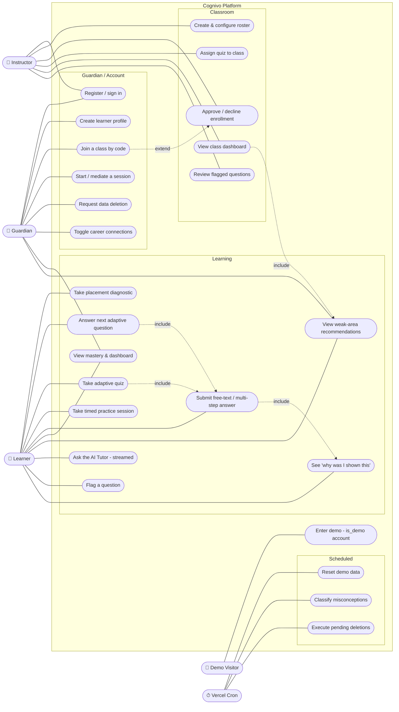
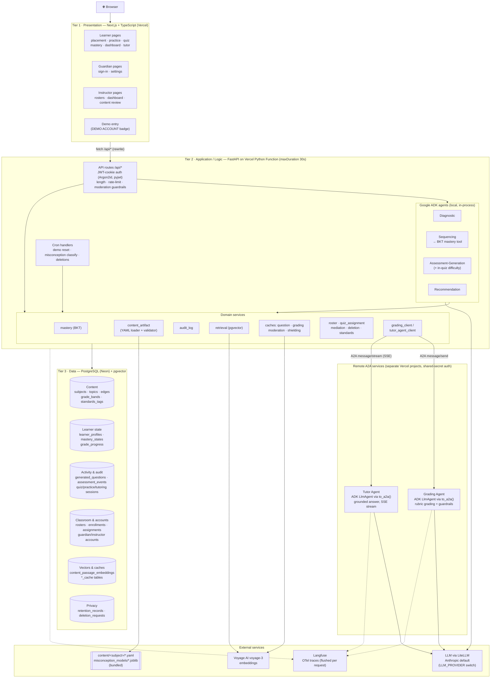

# Cognivo Architecture Diagrams

Three views of the system as it stands after Milestone 24 and the
off-sequence features (Standards Alignment, STEM-Career Connections,
K-12 Content Catalog pilot). Every node here is taken from the code:
`backend/src/api/routes/`, `backend/src/agents/`, `backend/src/services/`,
`backend/src/models/`, `grading-agent/`, `tutor-agent/`, and `vercel.json`.
`tech-stack.md` remains the authoritative source for technology decisions.
These diagrams describe it; they don't amend it.

Diagrams use [Mermaid](https://mermaid.js.org/), which GitHub renders inline.

---

## 1. Use Case Diagram (User Interactions)

Mermaid has no native UML use-case type. This uses a flowchart with
actors on the outside and use cases (rounded nodes) grouped inside the
system boundary.

Actors:

- **Learner** has no login of their own (spec 019). A learner acts
  inside a session that a guardian started, or through a quiz-session
  hand-off token.
- **Guardian** and **Instructor** are separate account tables
  (`real_guardian_accounts`, `real_instructor_accounts`). The same email
  may hold both roles.
- **Demo Visitor** enters only through the dedicated "View Demo" path
  and never through sign-up (Principle VIII). Every demo account it
  reaches carries `is_demo = true`.
- **Vercel Cron** is the system actor for the three scheduled jobs in
  `vercel.json`.

| Use case | Primary endpoint(s) |
|---|---|
| Take placement diagnostic | `POST /api/subjects/{id}/placement/start`, `.../submit`, `.../skip` |
| Answer next adaptive question | `GET /api/learners/{id}/next-question`, `POST /api/questions/{id}/answer` |
| Take adaptive quiz | `POST /api/quizzes`, `GET /api/quizzes/{id}/next-question`, `.../end` |
| Take timed practice session | `POST /api/practice-sessions`, `.../end` |
| View mastery & dashboard | `GET /api/learners/{id}/mastery-state` |
| View weak-area recommendations | `GET /api/learners/{id}/recommendations` |
| Ask the AI Tutor | `POST /api/tutor/sessions`, `.../messages`, `.../end` |
| Flag a question | `POST /api/questions/{id}/flag` |
| Register / sign in | `POST /api/auth/{guardian,instructor}/{register,login}` |
| Create learner profile | `POST /api/learners` |
| Join a class by code | `POST /api/rosters/join` |
| Request data deletion | `POST /api/deletion-requests` |
| Create & configure roster | `POST /api/rosters`, `PATCH /api/rosters/{id}` |
| Approve / decline enrollment | `POST /api/rosters/{id}/requests/{rid}/{approve,decline}` |
| Assign quiz to class | `POST/GET/DELETE /api/rosters/{id}/assignments` |
| View class dashboard | `GET /api/rosters/{id}/dashboard` |
| Review flagged questions | `GET /api/content-review/flagged`, `POST .../{qid}/resolve` |
| Enter demo | `GET /api/demo-learner`, `GET /api/demo-instructor` |
| Scheduled jobs | `GET /api/cron/{reset-demo-data,classify-misconceptions,execute-deletions}` |

---

## 2. Three-Tier Architecture Diagram (System Layers)

Everything ships as one Vercel project using Services (`vercel.json`).
`/api/*` goes to the FastAPI backend and everything else goes to
Next.js. The Grading Agent and the Tutor Agent are separately deployed,
stateless A2A services. They hold no database credentials, and the
backend is the only component that owns data.

Constraints that shape the tiers:

- **Stateless tiers 1 and 2.** No in-memory session state. ADK session
  state, mastery, and audit all persist to Postgres on every request
  (Principle IX).
- **The backend owns the data.** The A2A services are pure functions
  over the context the backend sends them. The backend runs `pgvector`
  retrieval and bundles the results for the Tutor Agent.
- **Two separate traces.** Langfuse records what happened inside a model
  call. The `assessment_events` audit log records why a pedagogical
  decision was made. Each one is required, and neither substitutes for
  the other (Principle V).

---

## 3. Entity-Relationship (ER) Diagram (Data Structure)

The diagram is generated from `backend/src/models/*.py`. Relationships
drawn as solid lines are real foreign keys. A dotted line (`..`) is a
logical link with no database constraint:

- `classroom_rosters.instructor_id` holds either a real or a demo
  instructor id.
- `generated_questions.placement_session_id` has no table of its own.
- `retention_records.account_id` and `deletion_requests.target_id` are
  polymorphic.

```mermaid
erDiagram
    %% ---------- Content (authored, subject-agnostic engine) ----------
    subjects {
        string subject_id PK
        string display_name
        string content_version
        datetime validated_at
    }
    topics {
        string subject_id PK,FK
        string topic_id PK
        string display_name
        bool is_entry_level
        json skill_definition
        int order_index
        json image_asset
        int grade
        bool step_grading_enabled
        json career_connection
    }
    prerequisite_edges {
        int edge_id PK
        string subject_id FK
        string from_topic_id FK
        string to_topic_id FK
    }
    grade_bands {
        string subject_id PK,FK
        int grade PK
    }
    standards_tags {
        string subject_id PK,FK
        string topic_id PK,FK
        string framework PK
        string code PK
        string title
    }
    content_passage_embeddings {
        uuid passage_id PK
        string subject_id FK
        string topic_id FK
        enum field
        text text
        vector embedding "1024-d"
        string content_version
    }

    %% ---------- Accounts & privacy ----------
    real_guardian_accounts {
        uuid guardian_id PK
        string email UK
        string password_hash
        bool is_demo
    }
    real_instructor_accounts {
        uuid instructor_id PK
        string email UK
        string password_hash
        bool is_demo
    }
    demo_instructor_profiles {
        uuid instructor_id PK
        string display_name
        bool is_demo
    }
    retention_records {
        uuid retention_record_id PK
        enum account_type
        uuid account_id
        enum authorized_by_type
        uuid authorized_by_id
        enum enrollment_status
        datetime became_inactive_at
        datetime inactivity_warning_sent_at
    }
    deletion_requests {
        uuid deletion_request_id PK
        enum target_type
        uuid target_id
        string requested_by
        datetime requested_at
        datetime completed_at
    }

    %% ---------- Learner state ----------
    learner_profiles {
        uuid learner_id PK
        string display_name
        bool is_demo
        uuid guardian_id FK
        uuid retention_record_id FK
        bool career_connections_enabled
    }
    mastery_states {
        uuid learner_id PK,FK
        string subject_id PK,FK
        string topic_id PK,FK
        float p_mastery "BKT"
        int update_count
        int consecutive_mastered_observations
        bool has_been_mastered
    }
    grade_progress {
        uuid learner_id PK,FK
        string subject_id PK,FK
        int unlocked_grade
    }

    %% ---------- Activity & audit ----------
    generated_questions {
        uuid question_id PK
        uuid learner_id FK
        string subject_id FK
        string topic_id FK
        enum difficulty
        enum question_type
        text stem
        json options
        json answer_key "rubric, generated with question"
        enum validation_status
        uuid flagged_by FK
        uuid quiz_session_id FK
        uuid practice_session_id FK
        uuid placement_session_id
        string generation_prompt_version
        int grade
    }
    assessment_events {
        uuid event_id PK
        uuid learner_id FK
        enum event_type
        uuid question_id FK
        string subject_id FK
        string topic_id FK
        json payload "why-explanations"
        datetime created_at
    }
    quiz_sessions {
        uuid quiz_session_id PK
        uuid learner_id FK
        string subject_id FK
        json topic_ids
        int question_count
        enum status
        int time_limit_seconds
    }
    practice_sessions {
        uuid practice_session_id PK
        uuid learner_id FK
        string subject_id FK
        int time_limit_seconds
        enum status
    }
    tutoring_sessions {
        uuid session_id PK
        uuid learner_id FK
        uuid guardian_id FK
        string subject_id FK
        enum status
    }
    tutor_exchanges {
        uuid exchange_id PK
        uuid session_id FK
        text question_text
        text answer_text
        bool grounded
        uuid_array retrieved_passage_ids
        bool shielded
        uuid shielded_question_id FK
        int shielding_checks_total
        int shielding_checks_from_cache
    }

    %% ---------- Classroom ----------
    classroom_rosters {
        uuid roster_id PK
        uuid instructor_id "real or demo, no FK"
        string subject_id FK
        int grade
        enum enrollment_mode
        string join_code UK
    }
    enrollments {
        uuid enrollment_id PK
        uuid learner_id FK
        uuid roster_id FK
        enum authorized_by_type
        uuid authorized_by_id
    }
    enrollment_requests {
        uuid enrollment_request_id PK
        uuid learner_id FK
        uuid roster_id FK
        enum decision
        datetime decided_at
    }
    quiz_assignments {
        uuid assignment_id PK
        uuid roster_id FK
        uuid instructor_id FK
        string subject_id FK
        json topic_ids
        int question_count
        datetime due_at
        datetime cancelled_at
    }
    quiz_assignment_targets {
        uuid assignment_target_id PK
        uuid assignment_id FK
        uuid learner_id FK
        uuid quiz_session_id FK
        datetime guardian_viewed_at
    }

    %% ---------- Caches (standalone, keyed by signature + version) ----------
    question_generation_cache {
        uuid cache_entry_id PK
        string subject_id FK
        string topic_id FK
        enum difficulty
        string content_version
        string generation_prompt_version
        text question_signature
        json answer_key
        int hit_count
    }
    grading_response_cache {
        uuid cache_entry_id PK
        text question_signature
        vector answer_embedding
        string grading_logic_version
        bool correct
        float graduated_score
        int hit_count
    }
    moderation_cache {
        uuid cache_entry_id PK
        text text_signature
        string moderation_instruction_version
        bool allowed
        int hit_count
    }
    shielding_classification_cache {
        uuid cache_entry_id PK
        text pair_signature
        string shielding_classification_instruction_version
        bool matches
        int hit_count
    }

    %% ---------- Relationships ----------
    subjects ||--o{ topics : contains
    subjects ||--o{ grade_bands : "has grades"
    topics ||--o{ prerequisite_edges : "from / to"
    topics ||--o{ standards_tags : "aligned to"
    topics ||--o{ content_passage_embeddings : "embedded as"
    topics ||--o{ question_generation_cache : "cached for"

    real_guardian_accounts |o--o{ learner_profiles : guards
    retention_records |o--o| learner_profiles : governs
    learner_profiles ||--o{ mastery_states : has
    topics ||--o{ mastery_states : "tracked on"
    learner_profiles ||--o{ grade_progress : unlocks
    subjects ||--o{ grade_progress : "per subject"

    learner_profiles ||--o{ generated_questions : "receives"
    learner_profiles |o--o{ generated_questions : "flags"
    topics ||--o{ generated_questions : "about"
    learner_profiles ||--o{ assessment_events : "audited in"
    generated_questions |o--o{ assessment_events : "referenced by"
    topics |o--o{ assessment_events : "about"

    learner_profiles ||--o{ quiz_sessions : takes
    subjects ||--o{ quiz_sessions : "in"
    quiz_sessions |o--o{ generated_questions : groups
    learner_profiles ||--o{ practice_sessions : takes
    subjects ||--o{ practice_sessions : "in"
    practice_sessions |o--o{ generated_questions : groups

    learner_profiles ||--o{ tutoring_sessions : opens
    real_guardian_accounts |o--o{ tutoring_sessions : mediates
    subjects ||--o{ tutoring_sessions : "in"
    tutoring_sessions ||--o{ tutor_exchanges : contains
    generated_questions |o--o{ tutor_exchanges : "shielded"

    subjects ||--o{ classroom_rosters : "scoped to"
    real_instructor_accounts |o..o{ classroom_rosters : "owns (logical)"
    demo_instructor_profiles |o..o{ classroom_rosters : "owns (logical)"
    classroom_rosters ||--o{ enrollments : has
    learner_profiles ||--o{ enrollments : "enrolled via"
    classroom_rosters ||--o{ enrollment_requests : receives
    learner_profiles ||--o{ enrollment_requests : submits

    classroom_rosters ||--o{ quiz_assignments : "assigned to"
    real_instructor_accounts ||--o{ quiz_assignments : creates
    subjects ||--o{ quiz_assignments : "in"
    quiz_assignments ||--o{ quiz_assignment_targets : targets
    learner_profiles ||--o{ quiz_assignment_targets : "assigned"
    quiz_sessions |o--o| quiz_assignment_targets : fulfils

    learner_profiles |o..o{ deletion_requests : "target (polymorphic)"
```

Notes on the model:

- **The audit log is append-only and typed.** `assessment_events.event_type`
  covers 21 values, from `answer_submitted` and `mastery_updated` to
  `next_topic_selected`, `misconception_classified`,
  `guardian_mediation_applied`, and `timed_session_ended`. New features
  add event types here instead of adding tables, as Milestones 2, 6, and
  11 did. This table answers "why was I shown this" and "why was this
  marked wrong."
- **No per-subject columns.** Subject-specific knowledge lives in
  `topics` JSON fields loaded from `content/<subject>/`, and engine
  tables never branch on `subject_id` (Principle III).
- **`MediationTier` is never stored.** It is derived at read time from
  `grade_progress.unlocked_grade` and recorded only inside the
  `guardian_mediation_applied` event payload.
- **Cache tables have no learner FK.** Each one is keyed by a content
  signature plus the prompt or instruction version, so a version bump
  invalidates its entries (Milestones 13 and 24).
